# Class Diagram - Labs Management System

## Mermaid Class Diagram

```mermaid
classDiagram
    class Building {
        -string buildingId
        -string buildingName
        -string attendantId
        +Building()
        +Building(id, name, attId)
        +getBuildingId() string
        +getBuildingName() string
        +getAttendantId() string
        +setBuildingId(id)
        +setBuildingName(name)
        +setAttendantId(attId)
        +serialize(ofstream)
        +deserialize(ifstream)
    }

    class Room {
        -string roomId
        -string roomNumber
        -string buildingId
        -int capacity
        +Room()
        +Room(id, number, bldgId, cap)
        +getRoomId() string
        +getRoomNumber() string
        +getBuildingId() string
        +getCapacity() int
        +setRoomId(id)
        +setRoomNumber(number)
        +setBuildingId(bldgId)
        +setCapacity(cap)
        +serialize(ofstream)
        +deserialize(ifstream)
    }

    class Instructor {
        -string instructorId
        -string name
        -string email
        -string department
        +Instructor()
        +Instructor(id, name, email, dept)
        +getInstructorId() string
        +getName() string
        +getEmail() string
        +getDepartment() string
        +setInstructorId(id)
        +setName(name)
        +setEmail(email)
        +setDepartment(dept)
        +serialize(ofstream)
        +deserialize(ifstream)
    }

    class TA {
        -string taId
        -string name
        -string email
        -string studentId
        +TA()
        +TA(id, name, email, sid)
        +getTaId() string
        +getName() string
        +getEmail() string
        +getStudentId() string
        +setTaId(id)
        +setName(name)
        +setEmail(email)
        +setStudentId(sid)
        +serialize(ofstream)
        +deserialize(ifstream)
    }

    class Time {
        +int hour
        +int minute
        +Time()
        +Time(h, m)
        +toHours() double
        +toMinutes() int
    }

    class Timing {
        -Time expectedStart
        -Time expectedEnd
        -Time actualStart
        -Time actualEnd
        -bool actualStartSet
        -bool actualEndSet
        +Timing()
        +Timing(expStart, expEnd)
        +getExpectedStart() Time
        +getExpectedEnd() Time
        +getActualStart() Time
        +getActualEnd() Time
        +isFilled() bool
        +setExpectedStart(t)
        +setExpectedEnd(t)
        +setActualStart(t)
        +setActualEnd(t)
        +getContactHours() double
        +serialize(ofstream)
        +deserialize(ifstream)
    }

    class Date {
        +int year
        +int month
        +int day
        +Date()
        +Date(y, m, d)
        +getDayOfWeek() int
    }

    class Section {
        -string sectionId
        -string labName
        -string courseCode
        -string instructorId
        -vector~string~ taIds
        -string roomId
        -string semester
        +Section()
        +Section(id, name, code, instId, rmId, sem)
        +getSectionId() string
        +getLabName() string
        +getCourseCode() string
        +getInstructorId() string
        +getTaIds() vector~string~
        +getRoomId() string
        +getSemester() string
        +setSectionId(id)
        +setLabName(name)
        +setCourseCode(code)
        +setInstructorId(instId)
        +setRoomId(rmId)
        +setSemester(sem)
        +addTA(taId)
        +removeTA(taId)
        +serialize(ofstream)
        +deserialize(ifstream)
    }

    class LabSession {
        -string sessionId
        -string sectionId
        -Date date
        -int dayOfWeek
        -Timing timing
        -bool isMakeup
        +LabSession()
        +LabSession(id, secId, date, expStart, expEnd)
        +getSessionId() string
        +getSectionId() string
        +getDate() Date
        +getDayOfWeek() int
        +getTiming() Timing
        +getIsMakeup() bool
        +setSessionId(id)
        +setSectionId(secId)
        +setDate(d)
        +setIsMakeup(makeup)
        +serialize(ofstream)
        +deserialize(ifstream)
    }

    class MakeupRequest {
        -string requestId
        -string sectionId
        -string instructorId
        -Date requestedDate
        -string reason
        -bool approved
        -Date makeupDate
        -bool makeupDateSet
        +MakeupRequest()
        +MakeupRequest(id, secId, instId, reqDate, reason)
        +getRequestId() string
        +getSectionId() string
        +getInstructorId() string
        +getRequestedDate() Date
        +getReason() string
        +isApproved() bool
        +getMakeupDate() Date
        +isMakeupDateSet() bool
        +setRequestId(id)
        +setSectionId(secId)
        +setInstructorId(instId)
        +setRequestedDate(d)
        +setReason(r)
        +setApproved(app)
        +setMakeupDate(d)
        +serialize(ofstream)
        +deserialize(ifstream)
    }

    class StorageManager {
        -static string DATA_DIR
        -static string BUILDINGS_FILE
        -static string ROOMS_FILE
        -static string INSTRUCTORS_FILE
        -static string TAS_FILE
        -static string SECTIONS_FILE
        -static string SESSIONS_FILE
        -static string MAKEUP_REQUESTS_FILE
        +saveBuilding(Building)
        +loadBuildings() vector~Building~
        +findBuilding(buildingId) Building*
        +saveRoom(Room)
        +loadRooms() vector~Room~
        +findRoom(roomId) Room*
        +findRoomsByBuilding(buildingId) vector~Room~
        +saveInstructor(Instructor)
        +loadInstructors() vector~Instructor~
        +findInstructor(instructorId) Instructor*
        +saveTA(TA)
        +loadTAs() vector~TA~
        +findTA(taId) TA*
        +saveSection(Section)
        +loadSections() vector~Section~
        +findSection(sectionId) Section*
        +saveSession(LabSession)
        +loadSessions() vector~LabSession~
        +findSessionsBySection(sectionId) vector~LabSession~
        +findSessionsByWeek(weekStart) vector~LabSession~
        +saveMakeupRequest(MakeupRequest)
        +loadMakeupRequests() vector~MakeupRequest~
        +findMakeupRequest(requestId) MakeupRequest*
    }

    class InputUtil {
        +readString(prompt) string
        +readInt(prompt) int
        +readDate(prompt) Date
        +readTime(prompt) Time
        +readDayOfWeek(prompt) int
        +readBoolean(prompt) bool
    }

    class AcademicOfficerUI {
        +showMenu()
        -addBuilding()
        -addRoom()
        -addInstructor()
        -addTA()
        -addSection()
        -scheduleLabSession()
        -viewBuildings()
        -viewRooms()
        -viewInstructors()
        -viewTAs()
        -viewSections()
        -viewMakeupRequests()
        -approveMakeupRequest()
    }

    class AttendantUI {
        -string attendantId
        +AttendantUI(attId)
        +showMenu()
        -fillTimesheet()
        -viewSessionsInBuilding()
    }

    class HeadOfDepartmentUI {
        +showMenu()
        -generateWeeklySchedule()
        -generateWeeklyTimesheet()
        -generateLabSectionTimesheet()
    }

    class InstructorUI {
        -string instructorId
        +InstructorUI(instId)
        +showMenu()
        -requestMakeupLab()
        -viewMySections()
        -viewMyMakeupRequests()
    }

    class MainMenu {
        +showMainMenu()
    }

    %% Relationships
    Building "1" --> "1" Room : contains
    Section "1" --> "1" Instructor : assigned
    Section "1" --> "*" TA : has
    Section "1" --> "1" Room : uses
    LabSession "1" --> "1" Section : belongs to
    LabSession "1" --> "1" Timing : has
    Timing "1" --> "2" Time : uses
    LabSession "1" --> "1" Date : scheduled on
    MakeupRequest "1" --> "1" Section : requests for
    MakeupRequest "1" --> "1" Instructor : requested by
    MakeupRequest "1" --> "2" Date : uses
    
    StorageManager ..> Building : manages
    StorageManager ..> Room : manages
    StorageManager ..> Instructor : manages
    StorageManager ..> TA : manages
    StorageManager ..> Section : manages
    StorageManager ..> LabSession : manages
    StorageManager ..> MakeupRequest : manages
    
    AcademicOfficerUI ..> StorageManager : uses
    AcademicOfficerUI ..> InputUtil : uses
    AttendantUI ..> StorageManager : uses
    AttendantUI ..> InputUtil : uses
    HeadOfDepartmentUI ..> StorageManager : uses
    HeadOfDepartmentUI ..> InputUtil : uses
    InstructorUI ..> StorageManager : uses
    InstructorUI ..> InputUtil : uses
    MainMenu ..> AcademicOfficerUI : uses
    MainMenu ..> AttendantUI : uses
    MainMenu ..> HeadOfDepartmentUI : uses
    MainMenu ..> InstructorUI : uses
    MainMenu ..> InputUtil : uses
```

## Diagram Description

### Core Model Classes
- **Building**: Represents university buildings with assigned attendants
- **Room**: Represents rooms within buildings
- **Instructor**: Represents lab instructors
- **TA**: Represents teaching assistants
- **Section**: Represents lab sections with one instructor and multiple TAs
- **LabSession**: Represents individual lab sessions with timing information
- **Timing**: Stores expected and actual start/end times
- **MakeupRequest**: Represents instructor requests for makeup labs

### Supporting Classes
- **Time**: Simple time structure (hour, minute)
- **Date**: Date structure (year, month, day)
- **StorageManager**: Handles all binary file operations
- **InputUtil**: Utility class for user input

### UI Classes
- **MainMenu**: Main entry point and menu router
- **AcademicOfficerUI**: Interface for academic officer operations
- **AttendantUI**: Interface for attendant timesheet operations
- **HeadOfDepartmentUI**: Interface for report generation
- **InstructorUI**: Interface for instructor operations

### Key Relationships
- **Composition**: LabSession contains Timing and Date
- **Association**: Section is associated with Instructor, Room, and multiple TAs
- **Dependency**: UI classes depend on StorageManager and InputUtil
- **Aggregation**: Building contains multiple Rooms

## How to Use This Diagram

1. **In VS Code**: Install "Markdown Preview Mermaid Support" extension
2. **Online**: Copy the mermaid code to https://mermaid.live/
3. **GitHub**: GitHub automatically renders Mermaid diagrams in markdown files
4. **Documentation**: Include in your project documentation

